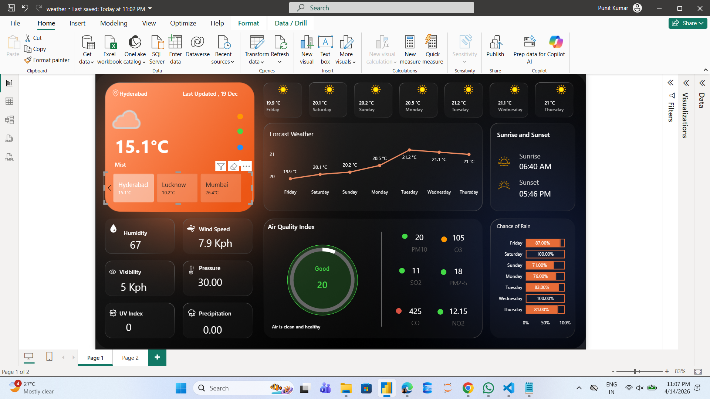
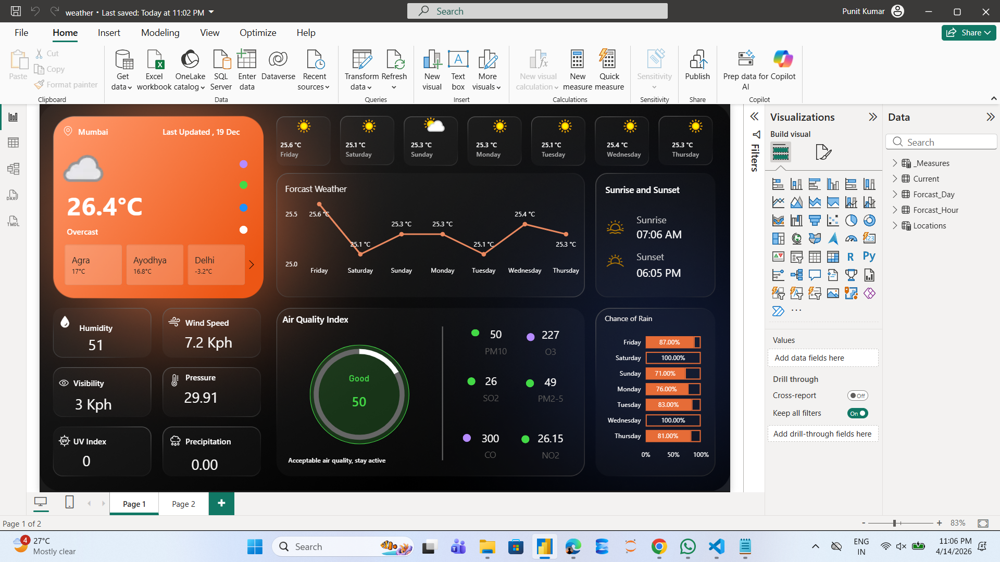

# 🌦️ Weather Dashboard (Power BI)

## 📌 About the Project

I built this Power BI dashboard to explore and present weather data in an interactive way. The idea was to bring together multiple parameters like temperature, air quality, humidity, and forecast into a single dashboard so users can quickly understand overall weather conditions.

---

## 📊 What this Dashboard Shows

* Current weather conditions (temperature & status)
* 7-day temperature forecast
* Air Quality Index (AQI)
* Chance of rain (daily)
* Sunrise and sunset timings
* Other metrics like humidity, wind speed, pressure, and visibility

This dashboard helps in quickly analyzing weather conditions and making informed decisions based on trends and forecasts.

---

## 🛠️ Tools Used

* Power BI
* DAX (Data Analysis Expressions)
* Data Modeling

---

## 📷 Dashboard Preview

### Main Dashboard

### Forecast & Trends

### Air Quality & Metrics

### Additional Insights

---

## ▶️ How to Use

1. Download the `weather.pbix` file
2. Open it using Power BI Desktop
3. Explore the dashboard and interact with visuals

> Note: Power BI Desktop is required to view the file.

---

## 💡 What I Learned

While working on this project, I got hands-on experience with:

* Designing clean and user-friendly dashboards
* Working with multiple visuals in Power BI
* Using DAX for calculations
* Structuring data properly for better insights

---

## ⚠️ Challenges Faced

* Managing layout and spacing for better UI
* Choosing the right visuals for each metric
* Making the dashboard clean without overcrowding

---

## 🚀 Future Improvements

* Add live weather API integration
* Include multiple city comparison
* Improve interactivity with more filters

---

## 📁 Files

* `weather.pbix` → Power BI dashboard file
* `Dashboard/` → Screenshots of dashboard

---

## ⭐ If you found this useful

Feel free to star the repository!
